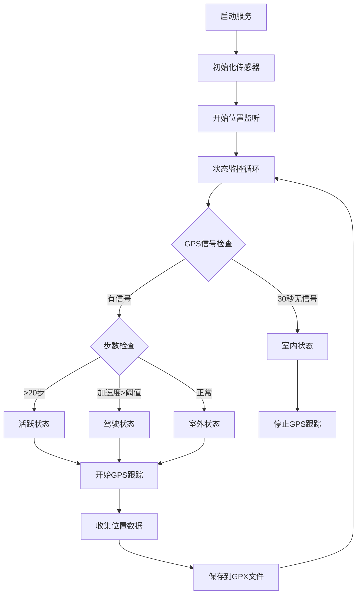
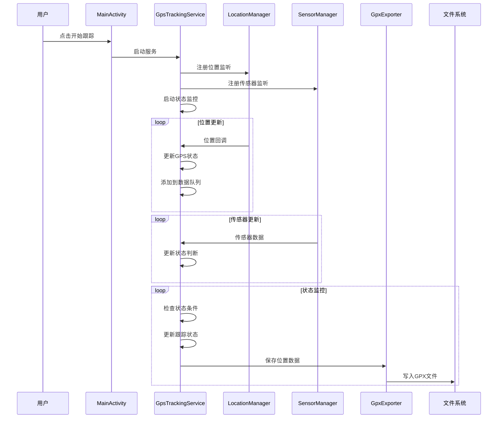

# GPS跟踪器架构文档

## 系统架构概述

GPS跟踪器应用采用分层架构设计，主要包含以下层次：

### 1. 表示层 (Presentation Layer)
- **MainActivity**: 用户界面控制器
- **布局文件**: XML界面定义
- **资源文件**: 字符串、颜色、主题等

### 2. 业务逻辑层 (Business Logic Layer)
- **GpsTrackingService**: 核心业务逻辑服务
- **状态管理**: 室内/室外/活跃/驾驶状态判断
- **传感器数据处理**: GPS、加速度、计步器数据

### 3. 数据层 (Data Layer)
- **GpsData**: 位置数据模型
- **TrackingState**: 状态枚举
- **GpxExporter**: 数据持久化和导出

### 4. 系统层 (System Layer)
- **Android系统服务**: LocationManager、SensorManager
- **权限管理**: 位置、传感器、存储权限
- **后台服务**: 前台服务实现

## 核心组件详细设计

### GpsTrackingService 服务架构

```kotlin
class GpsTrackingService : Service(), LocationListener, SensorEventListener {
    // 核心功能模块
    - 位置监听器 (LocationListener)
    - 传感器监听器 (SensorEventListener) 
    - 状态监控协程 (Coroutine)
    - 数据收集队列 (ConcurrentLinkedQueue)
    - 通知管理器 (NotificationManager)
}
```

#### 状态检测逻辑



### 传感器集成架构

#### GPS传感器
- **提供者**: LocationManager.GPS_PROVIDER
- **更新频率**: 1秒间隔
- **精度要求**: 1米
- **超时处理**: 30秒无信号判定为室内

#### 加速度传感器
- **类型**: Sensor.TYPE_ACCELEROMETER
- **用途**: 检测运动状态和驾驶行为
- **阈值**: 2.0f (重力加速度倍数)
- **计算**: 三轴加速度合成值

#### 计步器传感器
- **类型**: Sensor.TYPE_STEP_COUNTER
- **用途**: 检测用户活跃度
- **阈值**: 20步
- **状态**: 超过阈值进入活跃状态

### 数据流架构



## 状态机设计

### 状态定义
```kotlin
enum class TrackingState {
    INDOOR,    // 室内状态 - 停止GPS跟踪
    OUTDOOR,   // 室外状态 - 正常GPS跟踪  
    ACTIVE,    // 活跃状态 - 开始GPS跟踪
    DRIVING    // 驾驶状态 - 持续GPS跟踪
}
```

### 状态转换条件

| 当前状态 | 转换条件 | 目标状态 | 动作 |
|---------|---------|---------|------|
| 任意状态 | GPS信号超时(30s) | INDOOR | 停止GPS跟踪 |
| INDOOR | 获取GPS信号 | OUTDOOR | 开始GPS跟踪 |
| 任意状态 | 步数>20 | ACTIVE | 开始GPS跟踪 |
| 任意状态 | 加速度>阈值 | DRIVING | 开始GPS跟踪 |

### 状态优先级
1. **INDOOR** (最高优先级) - GPS超时强制进入
2. **DRIVING** - 驾驶状态检测
3. **ACTIVE** - 活跃状态检测  
4. **OUTDOOR** (最低优先级) - 默认室外状态

## 数据模型设计

### GpsData 位置数据模型
```kotlin
data class GpsData(
    val latitude: Double,      // 纬度
    val longitude: Double,     // 经度
    val altitude: Double,      // 海拔
    val accuracy: Float,       // 精度
    val timestamp: Long,       // 时间戳
    val state: TrackingState   // 采集时的状态
)
```

### GPX文件结构
```xml
<?xml version="1.0" encoding="UTF-8"?>
<gpx version="1.1" creator="GPS Tracker App">
  <metadata>
    <name>GPS Track 2024-01-01</name>
    <desc>GPS位置跟踪数据</desc>
    <time>2024-01-01T00:00:00Z</time>
  </metadata>
  <trk>
    <name>GPS Track</name>
    <desc>GPS位置跟踪轨迹</desc>
    <trkseg>
      <trkpt lat="39.9042" lon="116.4074">
        <ele>50.0</ele>
        <time>2024-01-01T00:00:00Z</time>
        <extensions>
          <accuracy>5.0</accuracy>
          <state>室外</state>
        </extensions>
      </trkpt>
    </trkseg>
  </trk>
</gpx>
```

## 性能优化策略

### 电量优化
1. **智能状态切换**: 根据用户活动自动调整跟踪频率
2. **传感器优化**: 使用低功耗传感器监听
3. **后台服务**: 前台服务避免被系统杀死
4. **数据批处理**: 批量保存减少I/O操作

### 内存优化
1. **数据队列**: 使用ConcurrentLinkedQueue避免内存泄漏
2. **协程管理**: 使用SupervisorJob管理协程生命周期
3. **及时释放**: 服务销毁时清理资源

### 存储优化
1. **文件分片**: 按日期分割GPX文件
2. **增量写入**: 追加模式写入减少文件操作
3. **数据压缩**: 可考虑压缩历史数据

## 安全考虑

### 权限管理
- 最小权限原则，仅申请必要权限
- 运行时权限检查
- 权限被拒绝时的优雅降级

### 数据隐私
- 本地存储，不上传云端
- 用户可控制数据导出
- 应用卸载时自动清理数据

### 系统安全
- 前台服务防止被杀死
- 异常处理避免崩溃
- 资源泄漏防护

## 扩展性设计

### 插件化架构
- 传感器插件接口
- 状态检测插件
- 数据导出插件

### 配置化
- 可配置的阈值参数
- 可调整的跟踪频率
- 可自定义的状态规则

### 多平台支持
- 模块化设计便于移植
- 统一的接口定义
- 平台特定实现分离

## 测试策略

### 单元测试
- 状态转换逻辑测试
- 传感器数据处理测试
- GPX文件生成测试

### 集成测试
- 服务生命周期测试
- 权限处理测试
- 文件操作测试

### 性能测试
- 电量消耗测试
- 内存使用测试
- 长时间运行稳定性测试

## 部署架构

### 构建流程


### 版本管理
- 语义化版本号
- 自动版本递增
- 发布说明生成

### 分发策略
- GitHub Releases
- APK文件下载
- 自动更新检查
