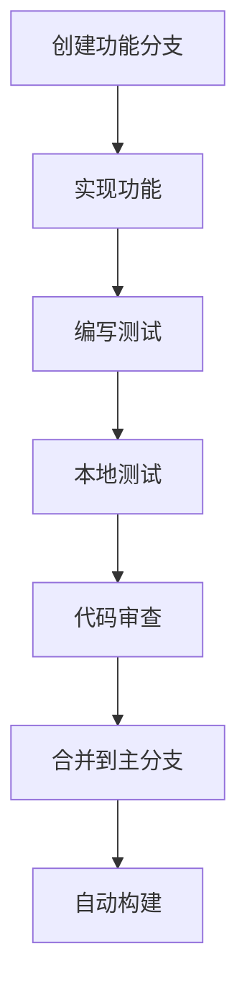

# GPS跟踪器开发文档

## 开发环境设置

### 必需工具
- **Android Studio**: Arctic Fox (2020.3.1) 或更高版本
- **JDK**: OpenJDK 17
- **Android SDK**: API Level 24+ (Android 7.0)
- **Gradle**: 8.4+
- **Git**: 版本控制

### 环境配置步骤

1. **安装Android Studio**
   ```bash
   # 下载并安装Android Studio
   # 配置Android SDK路径
   export ANDROID_HOME=$HOME/Android/Sdk
   export PATH=$PATH:$ANDROID_HOME/tools:$ANDROID_HOME/platform-tools
   ```

2. **克隆项目**
   ```bash
   git clone https://github.com/bprintlee/gps.git
   cd gps
   ```

3. **导入项目**
   - 打开Android Studio
   - 选择"Open an existing project"
   - 选择项目根目录

4. **同步依赖**
   ```bash
   ./gradlew build
   ```

## 项目结构说明

### 目录结构
```
gps/
├── app/                              # 主应用模块
│   ├── src/main/
│   │   ├── java/com/gpstracker/app/  # Kotlin源代码
│   │   ├── res/                      # 资源文件
│   │   └── AndroidManifest.xml       # 应用清单
│   ├── build.gradle                  # 模块构建配置
│   └── proguard-rules.pro           # 代码混淆规则
├── .github/workflows/                # GitHub Actions
├── gradle/                          # Gradle包装器
├── build.gradle                     # 项目构建配置
├── settings.gradle                  # 项目设置
├── gradle.properties               # Gradle属性
├── README.md                       # 项目说明
├── ARCHITECTURE.md                 # 架构文档
└── DEVELOPMENT.md                  # 开发文档
```

### 核心文件说明

#### MainActivity.kt
- **职责**: 用户界面控制器
- **功能**: 权限管理、服务控制、状态显示
- **关键方法**:
  - `checkPermissionsAndStartTracking()`: 权限检查和跟踪启动
  - `startTracking()`: 启动GPS跟踪服务
  - `stopTracking()`: 停止GPS跟踪服务

#### GpsTrackingService.kt
- **职责**: 核心业务逻辑服务
- **功能**: GPS数据采集、状态检测、传感器监听
- **关键组件**:
  - `LocationListener`: GPS位置监听
  - `SensorEventListener`: 传感器数据监听
  - 状态监控协程
  - 数据收集队列

#### GpxExporter.kt
- **职责**: 数据持久化和导出
- **功能**: GPX文件生成、数据保存、文件管理
- **关键方法**:
  - `appendGpsData()`: 追加位置数据
  - `exportGpxFile()`: 导出GPX文件
  - `getAllGpxFiles()`: 获取所有GPX文件

## 开发工作流

### 1. 功能开发流程



### 2. 分支管理策略

- **main**: 主分支，稳定版本
- **develop**: 开发分支，集成最新功能
- **feature/***: 功能分支，新功能开发
- **hotfix/***: 热修复分支，紧急修复

### 3. 提交规范

```bash
# 提交信息格式
<type>(<scope>): <description>

# 类型说明
feat: 新功能
fix: 修复bug
docs: 文档更新
style: 代码格式调整
refactor: 代码重构
test: 测试相关
chore: 构建过程或辅助工具的变动

# 示例
feat(gps): 添加室内状态检测功能
fix(service): 修复GPS服务内存泄漏问题
docs(readme): 更新安装说明
```

## 代码规范

### Kotlin编码规范

1. **命名规范**
   ```kotlin
   // 类名使用PascalCase
   class GpsTrackingService
   
   // 函数和变量使用camelCase
   fun startLocationUpdates()
   var currentState: TrackingState
   
   // 常量使用UPPER_SNAKE_CASE
   companion object {
       private const val GPS_TIMEOUT_MS = 30000L
   }
   ```

2. **函数设计**
   ```kotlin
   // 单一职责原则
   private fun updateTrackingState() {
       // 只负责状态更新逻辑
   }
   
   // 参数验证
   private fun saveGpsData(data: List<GpsData>) {
       require(data.isNotEmpty()) { "数据不能为空" }
       // 处理逻辑
   }
   ```

3. **异常处理**
   ```kotlin
   try {
       locationManager.requestLocationUpdates(...)
   } catch (e: SecurityException) {
       Log.e(TAG, "位置权限被拒绝", e)
       // 优雅降级处理
   }
   ```

### Android开发规范

1. **生命周期管理**
   ```kotlin
   override fun onDestroy() {
       super.onDestroy()
       // 清理资源
       locationManager.removeUpdates(this)
       sensorManager.unregisterListener(this)
       serviceScope.cancel()
   }
   ```

2. **权限处理**
   ```kotlin
   private fun checkPermissionsAndStartTracking() {
       val permissionsToRequest = permissions.filter {
           ContextCompat.checkSelfPermission(this, it) != PackageManager.PERMISSION_GRANTED
       }
       
       if (permissionsToRequest.isNotEmpty()) {
           permissionLauncher.launch(permissionsToRequest.toTypedArray())
       } else {
           startTracking()
       }
   }
   ```

3. **协程使用**
   ```kotlin
   private val serviceScope = CoroutineScope(Dispatchers.IO + SupervisorJob())
   
   private fun startStateMonitoring() {
       serviceScope.launch {
           while (isActive) {
               updateTrackingState()
               delay(5000)
           }
       }
   }
   ```

## 测试策略

### 单元测试

1. **状态转换测试**
   ```kotlin
   @Test
   fun testIndoorStateTransition() {
       // 模拟GPS超时
       service.lastGpsTime = System.currentTimeMillis() - 35000
       service.updateTrackingState()
       
       assertEquals(TrackingState.INDOOR, service.currentState)
   }
   ```

2. **传感器数据处理测试**
   ```kotlin
   @Test
   fun testAccelerometerData() {
       val event = createMockSensorEvent(Sensor.TYPE_ACCELEROMETER, floatArrayOf(1f, 2f, 3f))
       service.onSensorChanged(event)
       
       assertTrue(service.lastAcceleration > 0)
   }
   ```

### 集成测试

1. **服务生命周期测试**
   ```kotlin
   @Test
   fun testServiceLifecycle() {
       val intent = Intent(context, GpsTrackingService::class.java)
       context.startForegroundService(intent)
       
       // 验证服务启动
       assertTrue(service.isRunning)
       
       context.stopService(intent)
       // 验证服务停止
       assertFalse(service.isRunning)
   }
   ```

2. **GPX文件生成测试**
   ```kotlin
   @Test
   fun testGpxFileGeneration() {
       val testData = listOf(
           GpsData(39.9042, 116.4074, 50.0, 5.0f, System.currentTimeMillis(), TrackingState.OUTDOOR)
       )
       
       runBlocking {
           gpxExporter.appendGpsData(testData)
           val filePath = gpxExporter.exportGpxFile()
           
           assertNotNull(filePath)
           assertTrue(File(filePath).exists())
       }
   }
   ```

### 性能测试

1. **内存使用测试**
   ```kotlin
   @Test
   fun testMemoryUsage() {
       val initialMemory = Runtime.getRuntime().totalMemory()
       
       // 模拟大量数据
       repeat(1000) {
           service.addGpsData(createTestGpsData())
       }
       
       val finalMemory = Runtime.getRuntime().totalMemory()
       val memoryIncrease = finalMemory - initialMemory
       
       // 验证内存增长在合理范围内
       assertTrue(memoryIncrease < 10 * 1024 * 1024) // 小于10MB
   }
   ```

2. **电量消耗测试**
   ```kotlin
   @Test
   fun testBatteryConsumption() {
       val batteryManager = context.getSystemService(Context.BATTERY_SERVICE) as BatteryManager
       val initialLevel = batteryManager.getIntProperty(BatteryManager.BATTERY_PROPERTY_CAPACITY)
       
       // 运行服务1小时
       runBlocking {
           delay(3600000) // 1小时
       }
       
       val finalLevel = batteryManager.getIntProperty(BatteryManager.BATTERY_PROPERTY_CAPACITY)
       val batteryDrain = initialLevel - finalLevel
       
       // 验证电量消耗在合理范围内
       assertTrue(batteryDrain < 20) // 小于20%
   }
   ```

## 调试技巧

### 日志调试

1. **日志级别使用**
   ```kotlin
   Log.d(TAG, "调试信息: $debugInfo")
   Log.i(TAG, "一般信息: $info")
   Log.w(TAG, "警告信息: $warning")
   Log.e(TAG, "错误信息: $error", exception)
   ```

2. **条件日志**
   ```kotlin
   if (BuildConfig.DEBUG) {
       Log.d(TAG, "调试信息仅在Debug版本显示")
   }
   ```

### 性能分析

1. **内存分析**
   ```kotlin
   // 使用Android Studio Profiler
   // 或添加内存监控代码
   private fun logMemoryUsage() {
       val runtime = Runtime.getRuntime()
       val usedMemory = runtime.totalMemory() - runtime.freeMemory()
       Log.d(TAG, "内存使用: ${usedMemory / 1024 / 1024}MB")
   }
   ```

2. **电量分析**
   ```kotlin
   // 使用Battery Historian分析
   // 或添加电量监控代码
   private fun logBatteryLevel() {
       val batteryManager = getSystemService(Context.BATTERY_SERVICE) as BatteryManager
       val level = batteryManager.getIntProperty(BatteryManager.BATTERY_PROPERTY_CAPACITY)
       Log.d(TAG, "电量: $level%")
   }
   ```

## 构建和部署

### 本地构建

1. **Debug构建**
   ```bash
   ./gradlew assembleDebug
   # 输出: app/build/outputs/apk/debug/app-debug.apk
   ```

2. **Release构建**
   ```bash
   ./gradlew assembleRelease
   # 输出: app/build/outputs/apk/release/app-release-unsigned.apk
   ```

3. **签名Release版本**
   ```bash
   # 生成签名密钥
   keytool -genkey -v -keystore release-key.keystore -alias gps-tracker -keyalg RSA -keysize 2048 -validity 10000
   
   # 配置签名信息
   # 在app/build.gradle中添加签名配置
   ```

### GitHub Actions构建

1. **触发条件**
   - 推送到main或develop分支
   - 创建Pull Request到main分支

2. **构建步骤**
   - 设置JDK 17环境
   - 运行单元测试
   - 构建Debug和Release APK
   - 上传构建产物

3. **构建产物**
   - `app-debug-apk`: Debug版本APK
   - `app-release-apk`: Release版本APK

## 常见问题解决

### 1. 权限问题
```kotlin
// 问题: 位置权限被拒绝
// 解决: 添加权限检查和用户引导
if (ContextCompat.checkSelfPermission(this, Manifest.permission.ACCESS_FINE_LOCATION) 
    != PackageManager.PERMISSION_GRANTED) {
    // 显示权限说明对话框
    showPermissionRationale()
}
```

### 2. 服务被杀死
```kotlin
// 问题: 后台服务被系统杀死
// 解决: 使用前台服务
private fun createNotification(): Notification {
    return NotificationCompat.Builder(this, CHANNEL_ID)
        .setContentTitle("GPS跟踪服务")
        .setContentText("正在后台跟踪位置")
        .setSmallIcon(R.drawable.ic_launcher_foreground)
        .setOngoing(true)
        .build()
}
```

### 3. 内存泄漏
```kotlin
// 问题: 服务未正确清理资源
// 解决: 在onDestroy中清理
override fun onDestroy() {
    super.onDestroy()
    locationManager.removeUpdates(this)
    sensorManager.unregisterListener(this)
    serviceScope.cancel()
}
```

### 4. GPS信号不稳定
```kotlin
// 问题: GPS信号经常丢失
// 解决: 添加超时检测和状态切换
private fun updateTrackingState() {
    val gpsTimeout = (System.currentTimeMillis() - lastGpsTime) > gpsTimeoutMs
    if (gpsTimeout) {
        currentState = TrackingState.INDOOR
        isGpsAvailable = false
    }
}
```

## 性能优化建议

### 1. 电量优化
- 使用低功耗传感器监听
- 智能调整GPS更新频率
- 避免不必要的网络请求
- 合理使用WakeLock

### 2. 内存优化
- 及时释放不用的资源
- 使用对象池避免频繁创建
- 避免内存泄漏
- 合理使用缓存

### 3. 存储优化
- 批量写入减少I/O操作
- 使用压缩存储历史数据
- 定期清理过期数据
- 异步处理文件操作

## 贡献指南

### 1. 提交代码
- Fork项目到个人仓库
- 创建功能分支
- 提交代码并创建Pull Request
- 等待代码审查

### 2. 代码审查标准
- 代码符合项目规范
- 包含必要的测试
- 更新相关文档
- 通过所有测试

### 3. 问题报告
- 使用GitHub Issues报告问题
- 提供详细的复现步骤
- 包含设备信息和日志
- 使用标签分类问题
